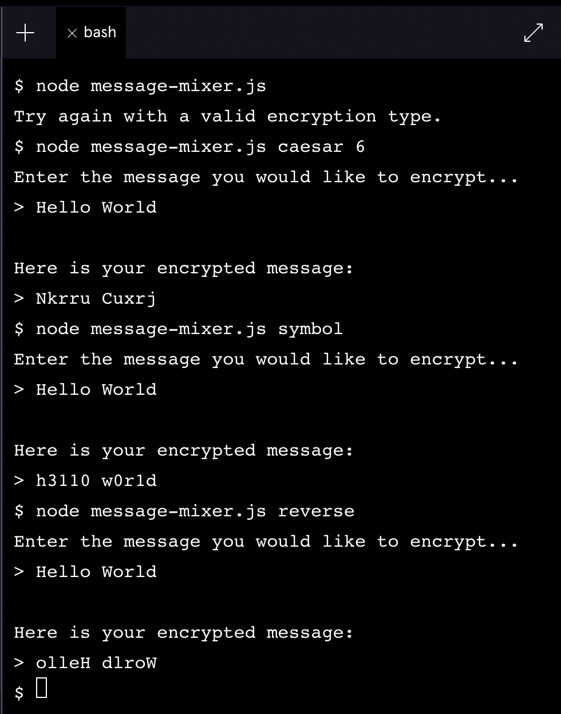
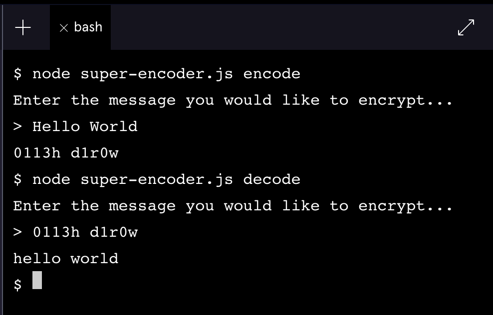

# Test file for Message-Mixer encryption
### A simple encryption tool project by me

## Krutarth Ghuge

### Test 1
#### Using the 3 encryptors to encrypt the phrase 'Hello World' in different ways

### Test 2
#### Using the super encoder to encode and decode phrases

